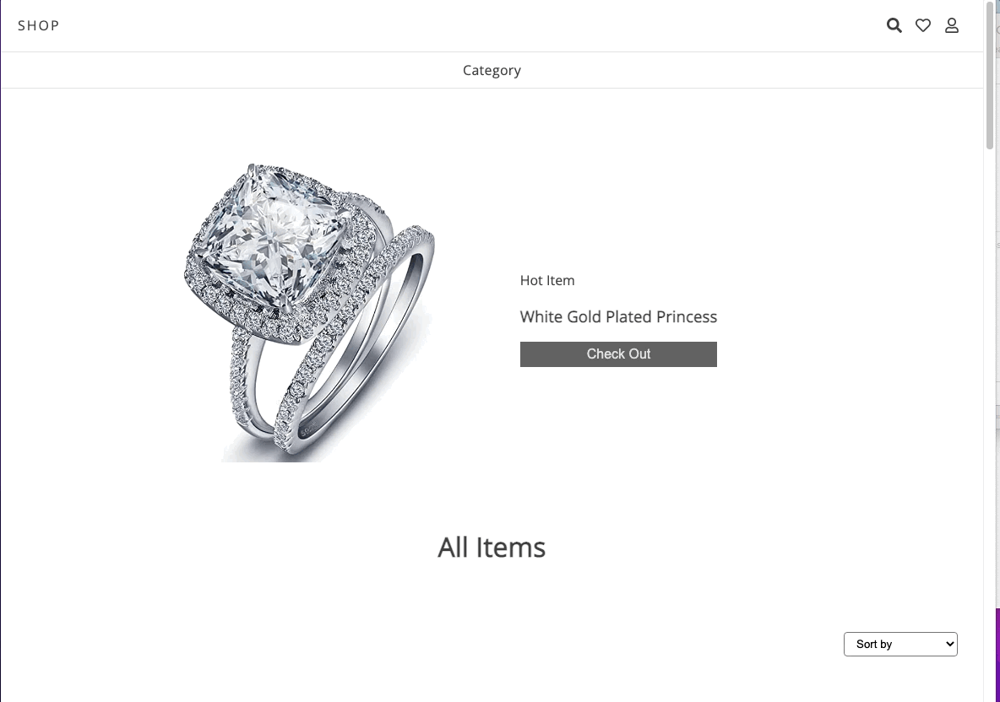

# Online store 

A responsive online store website with [Fake Store API](https://fakestoreapi.com/).

Different products are displayed by catetories and can be sorted by price. Users can sign in (without real backend) and they can add products on their carts.

[Live Demo](https://shop-with-api.netlify.app)


## Lessons Learned

- REST API
- Manage Global State with createContext & useContext
- fake authentication guard
- custom hooks
- localstorage


## Demo



## Run Locally

Install

```bash
  yarn
```
Start app 
```bash
  yarn start
```


